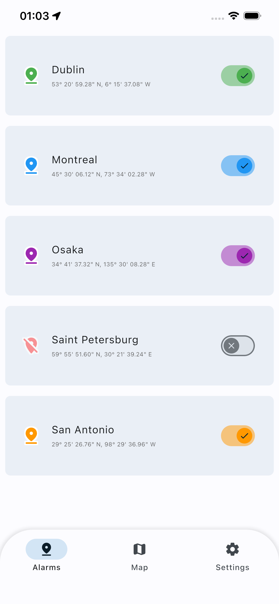
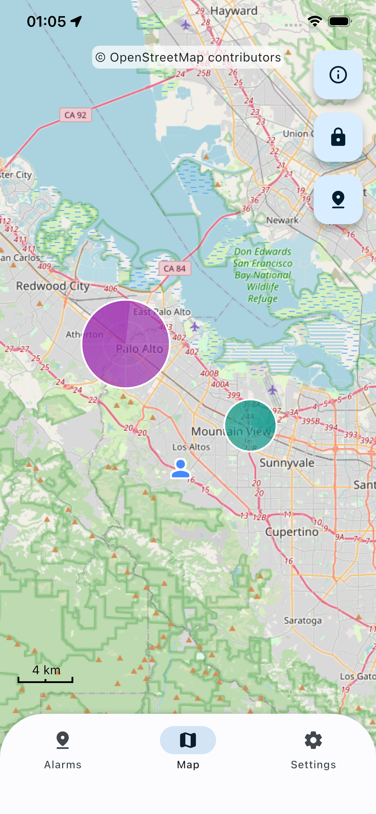
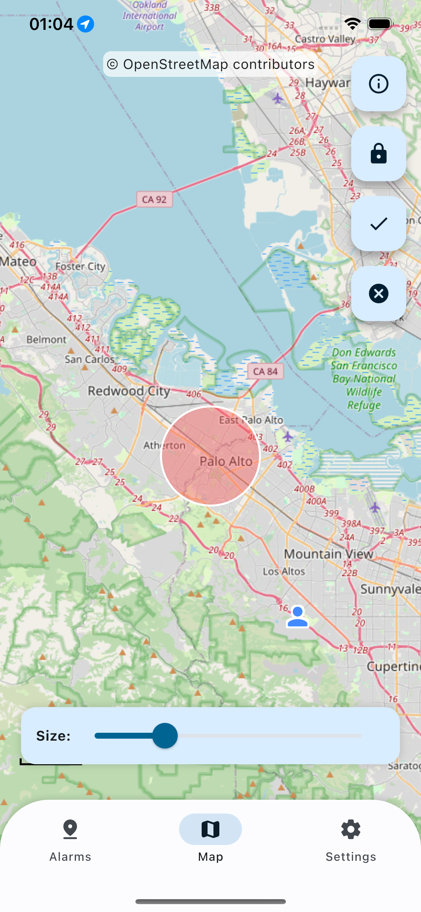
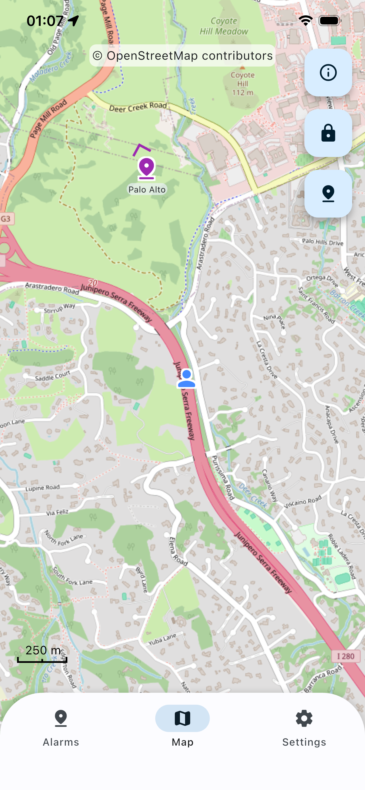

# Spot Alert

A location-based alarm app designed for travel. Set alarms at specific places and get notified when you arrive—so you never miss a stop, destination, or moment.

Built in Flutter using geofencing, mapping, and notification libraries.

